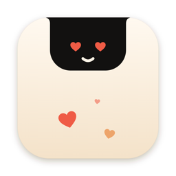
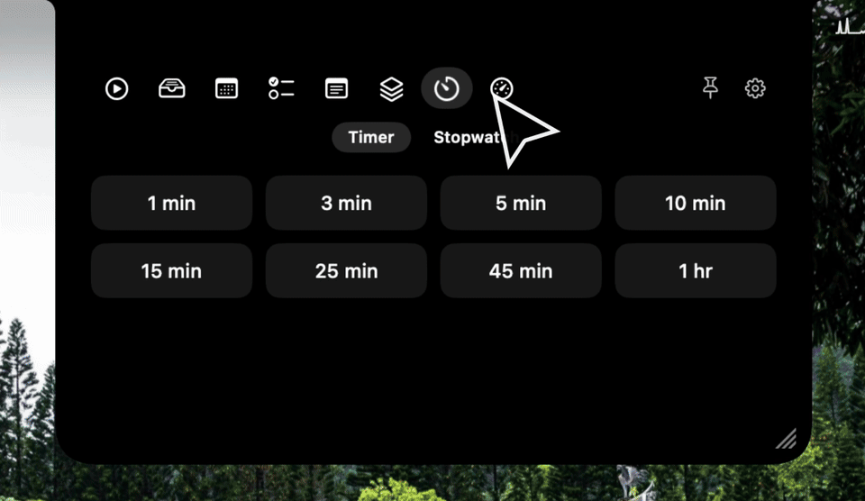
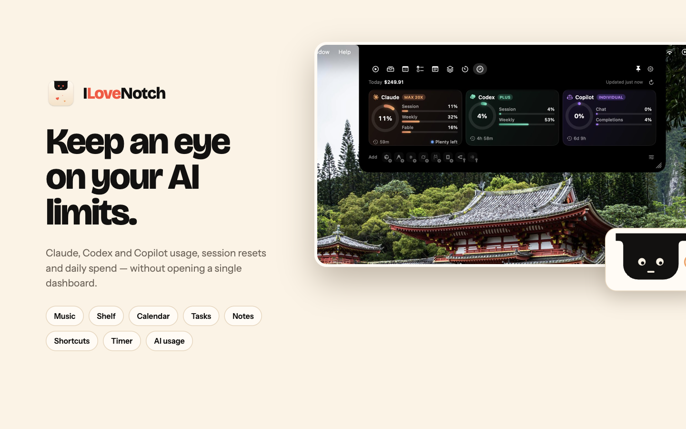
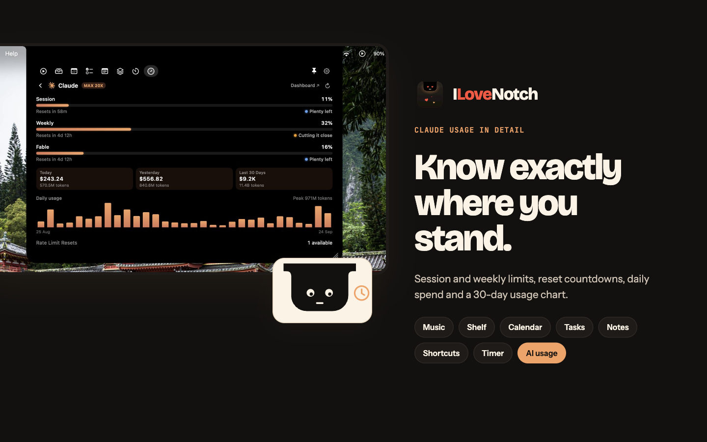
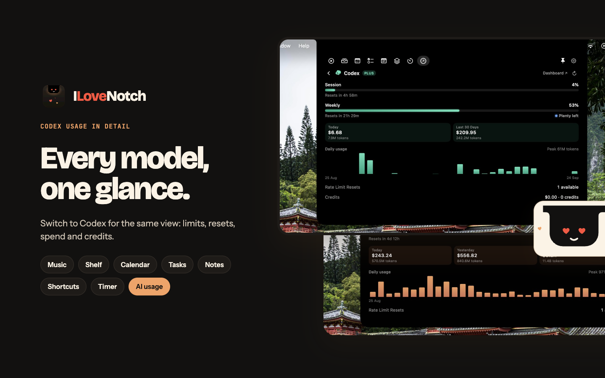
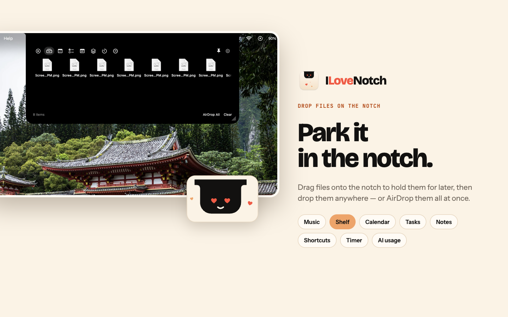
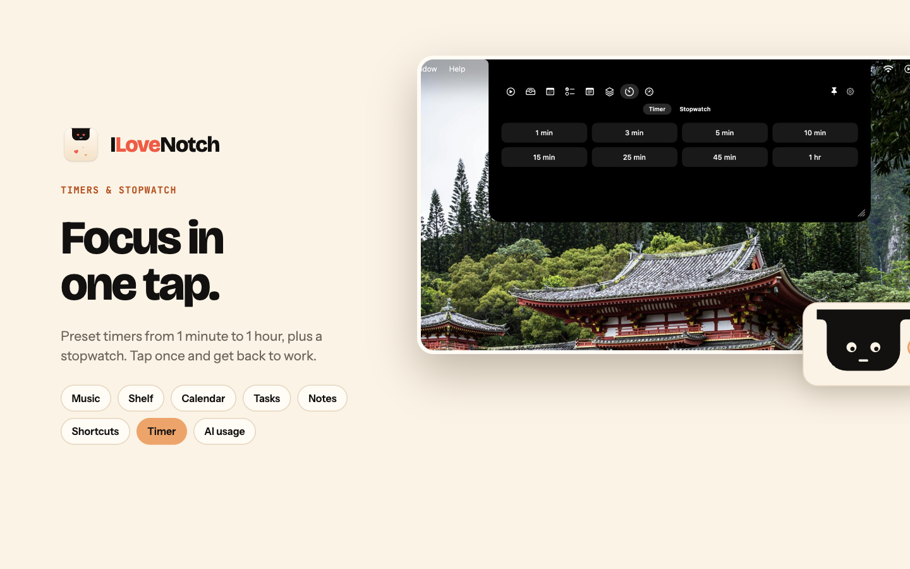
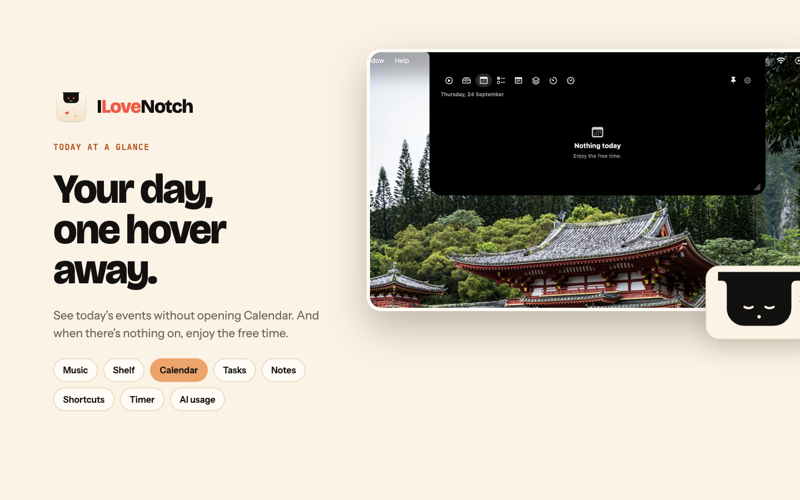

https://github.com/user-attachments/assets/9d0c486c-5169-4297-b8b9-8fedbb9eadda

<p align="center">
  
</p>

<h1 align="center">ILoveNotch</h1>

<p align="center"><b>Your MacBook's notch, finally useful.</b> Free and open source.</p>

<p align="center">
  <a href="https://github.com/niyamvora/ILoveNotch/actions/workflows/ci.yml"></a>
  <a href="LICENSE"></a>
  <a href="#build--run"></a>
  <a href="https://github.com/sponsors/niyamvora"></a>
</p>

An **original, open-source** macOS menu-notch utility — turns the notch on Apple
Silicon MacBooks into an interactive tray for media, files, your calendar, tasks,
notes, shortcuts, timers, your camera, and how much of your AI plans you've
used. Built native (SwiftUI + AppKit) with a **hard focus on low RAM and
near-zero idle CPU**.

<p align="center">
  
</p>

<p align="center">
  
  
  
  
  
  
</p>

> **Not affiliated with, endorsed by, or derived from any commercial notch app.**
> This is a clean-room implementation written from scratch. It contains no
> disassembled or decompiled code, and nothing from any commercial notch app.
> Features are common-idea reimplementations. Everything here is original or
> comes from permissively licensed open-source projects (MIT, BSD, CC0), listed
> in [THIRD_PARTY_NOTICES.md](THIRD_PARTY_NOTICES.md).

## What it does

- **The notch.** Opens when you hover it, click it, or pull down with two
  fingers, and closes when you move away. Closed, it hides behind the camera
  housing. Pick how it opens and closes (spring, jelly, pop, smooth, snappy, or
  instant), drag its bottom-right corner to resize it, and pin it open. Works on
  every display, as a floating pill where there's no notch.
- **Media.** What's playing in any app, with artwork, controls, a seek bar, and
  a waveform that moves with the music.
- **Shelf.** Drop files on the notch to keep them at hand; drag them back out,
  preview them with Quick Look, or send them with AirDrop.
- **Calendar and Tasks.** Today's events, and your Apple Reminders to check off
  and add, synced to your iPhone through iCloud.
- **Notes, Shortcuts, and Timer.** Quick notes that save as you type, your
  shortcuts one click away, and a timer and a stopwatch with laps.
- **Mirror.** Your camera, off until you turn it on, and on only while its tab
  is open.
- **AI Usage.** How much of each AI coding plan you've used, as a card per tool,
  across 11 providers. [More below](#ai-usage).
- **System activities.** Volume, charging and battery, and Bluetooth accessory
  batteries show briefly in the notch, and it can stand in for the macOS volume
  display.
- **Updates.** A build from this checkout updates itself from the menu bar;
  signed releases update through Sparkle. A sandboxed Mac App Store edition
  builds from the same code.

### What's left

Everything above is built and tested, with its name and icon. Before the first
public release: a Developer ID certificate for signed downloads
([releasing](docs/releasing.md)), and the Mac App Store listing
([App Store edition](docs/plan/implementation-plan.md#app-store-edition)).

## Why

Notch utilities are genuinely useful, but the popular closed-source one is
unmaintained and drew complaints about heavy RAM/CPU use. ILoveNotch is a free,
maintained, efficient alternative anyone can inspect and improve.

## Design principles (the efficiency story)

1. **No polling timers.** State changes come from events (hover, clicks, system
   notifications). The only timers are one-shot deadlines, like the hover dwell,
   cancelled the moment they stop mattering. Idle app = idle CPU.
2. **Accessory app.** No Dock icon (`LSUIElement`), one small menu bar item for
   Settings and Quit, and the notch never steals focus (`nonactivatingPanel`).
3. **Lazy features.** Each feature module is `stopped`, `background` (cheap
   event observers only), or `foreground` (on screen). Hidden tabs cost nothing.
4. **Native, no Electron/webview.** Pure SwiftUI/AppKit.
5. **Measured, not assumed.** Signposts on every event, performance tests in CI,
   and an Instruments pass per feature against the
   [performance budgets](docs/plan/implementation-plan.md#8-performance-gates).

## Architecture

```text
hover, clicks, drags, sleep/lock, display changes
  → NotchEvent
  → NotchState.handle(_:)   pure reducer: next state + effects
  → NotchEngine             one per display: runs deadline timers
  → FeatureHost             runs each feature at the highest phase any display asks for
  → NotchView               one animatable notch shape inside a fixed panel
```

| Module | Role |
|--------|------|
| `App/` | App target generated from `project.yml`: wires features in, menu bar item, Settings |
| `NotchCore` | State machine, `NotchEngine`, `FeatureHost` lifecycle, preferences, typed logging and signposts. No AppKit. |
| `NotchSurface` | Fixed click-through `NSPanel` per display, animatable `NotchShape`, `PanelCoordinator` (displays, sleep, lock), notch geometry from **public** APIs (`safeAreaInsets`, `auxiliaryTop*Area`) |
| `NotchFeatures` | Feature modules (Media, Shelf, Calendar, Tasks, Notes, Shortcuts, Timer, Mirror), each a `NotchFeature` with its views and settings, and the event-driven system monitors (volume, battery, accessories, volume keys) |
| `NotchUsage` | The AI Usage tab: provider tiles, rings, pace, spend, and trends, over providers adapted from [OpenUsage](https://github.com/robinebers/openusage) (MIT) in `NotchUsage/OpenUsage` |
| `ThirdParty/` | [mediaremote-adapter](https://github.com/ungive/mediaremote-adapter) (BSD-3-Clause) as a git submodule |
| `Tests/` | Unit tests (reducer transitions and fuzzing, engine, feature host, preferences, geometry, features), offscreen snapshot tests, XCTest performance tests, and OpenUsage's provider tests on its fixtures (`OpenUsageTests`) |

The full design is in the [implementation plan](docs/plan/implementation-plan.md)
and the [architecture diagram](docs/plan/architecture.html).

## Build & run

Requires macOS 14.6+, Xcode 16+, and [Homebrew](https://brew.sh).

```bash
git clone --recurse-submodules https://github.com/niyamvora/ILoveNotch.git
cd ILoveNotch
make setup                        # installs XcodeGen (Brewfile) and fetches submodules
make run                          # generate the Xcode project, build, and launch ILoveNotch.app
make install                      # build a Release app into /Applications and launch it
make update                       # pull main when it's clean, then reinstall and relaunch
make test                         # unit, snapshot, and performance tests (plain SwiftPM)
make check                        # everything CI runs: secrets, lint, tests, build, licenses
make build-app-store              # the sandboxed App Store edition
scripts/soak.sh                   # sample the running app's CPU and memory against the budgets
```

`make project` generates `OpenNotch.xcodeproj` (git-ignored) for working in Xcode. The project,
its targets, and the code keep the original name OpenNotch; the app is ILoveNotch everywhere
people see it.
Watch the state machine live with:

```bash
log stream --level debug --predicate 'subsystem == "cafe.opennotch.app"'
```

### Test it on your Mac

1. `make install` builds a Release app into `/Applications` and launches it.
   There's no Dock icon: look for the notch, and for the ILoveNotch item in the
   menu bar (version, Update ILoveNotch, Settings…, Sponsor, Quit).
2. Quit other notch apps first; two apps can't share the notch.
3. Hover the notch (or click it, or pull down with two fingers), then try each
   tab. Calendar and Tasks ask for access the first time you tap **Allow Access**.
   Resize the open notch by dragging its bottom-right corner, keep it open with
   the pin beside Settings, and pick how it opens and closes in
   **Settings › General**.
4. To get the latest, choose **Update ILoveNotch** from the menu bar item (or run
   `make update`). It pulls `main` when your checkout is clean, rebuilds, and
   relaunches; see [updates](docs/updates.md).
5. With an Apple Development certificate in your keychain (Xcode › Settings ›
   Accounts), builds are signed with it and keep Calendar and Reminders access
   across updates. Without one they're ad-hoc signed, and macOS asks again after
   each rebuild.
6. To start at login, turn on **Settings › General › Launch at login**.
7. To uninstall, choose **Quit** from the menu bar item and delete
   `/Applications/ILoveNotch.app`; data lives in
   `~/Library/Application Support/OpenNotch`.

## Now playing

Since macOS 15.4, only Apple's own processes may read system-wide now-playing
information. ILoveNotch uses [mediaremote-adapter](https://github.com/ungive/mediaremote-adapter),
which runs in the system `perl` (an Apple process) as a separate helper, so the
private framework never loads into ILoveNotch. If a future macOS breaks it, Media
falls back to Music and Spotify's public notifications and says so.

The waveform under the player moves with the music. It listens to your Mac's
audio output only while Media is open and playing, so macOS asks once for
permission to capture system audio. Nothing is recorded; see
[PRIVACY.md](PRIVACY.md). Turn it off in **Settings › Features › Media**.

## AI usage

The AI Usage tab shows how much of your AI coding plans you've used, as a small
dashboard card per tool:

- Claude, Codex, Cursor, Copilot, Antigravity, Devin, Grok, Ollama, OpenCode,
  OpenRouter, and Z.ai are supported.
- Each card shows its main limit as a ring, the others as bars, when they reset,
  and whether they'll last until then. Click a card for spend, the daily trend,
  and every limit.
- Alerts show in the notch when a limit passes 80% or 95%, or resets.

Each provider is off until you add it from the tray under the cards, where the
tools signed in on this Mac are in color, or in **Settings › AI Usage**.
OpenRouter and Z.ai have no sign-in to reuse, so they take an API key, pasted
in **Settings › AI Usage** and kept in your keychain.

Each provider reads the sign-in its own tool keeps on this Mac and sends it only
to its own service. What it reads and sends is in
[PRIVACY.md](PRIVACY.md#ai-usage). The provider code is adapted from
[OpenUsage](https://github.com/robinebers/openusage) (MIT), and ILoveNotch isn't
affiliated with it. The tab is in the GitHub build only: reading other tools'
sign-ins doesn't fit the App Store's sandbox.

## Tasks and notes

Tasks use Apple **Reminders** through EventKit, so they sync to your iPhone over
iCloud with no server to run. Notes are plain-text files in
`~/Library/Application Support/OpenNotch/Notes`, with optional iCloud sync
later; driving Apple Notes through Apple Events was dropped as brittle and
permission-heavy. (Google **Keep** is intentionally not used: it has no official
API.) Calendar and Reminders access is requested only when you tap **Allow
Access** in their tab.

## Contributing

Questions and ideas go in [Discussions](https://github.com/niyamvora/ILoveNotch/discussions);
bugs and feature requests in [Issues](https://github.com/niyamvora/ILoveNotch/issues/new/choose).
See [CONTRIBUTING.md](CONTRIBUTING.md). Report vulnerabilities privately as
described in [SECURITY.md](SECURITY.md); privacy commitments are in
[PRIVACY.md](PRIVACY.md).

## Sponsors

ILoveNotch is free and open source. If it's useful to you,
[sponsor the project](https://github.com/sponsors/niyamvora) to help keep it
maintained, and star the repo so more people find it.

<!-- ponytail: add a tiered logo table here (like chanhdai.com's README) once there are sponsors -->

## License

MIT — see [LICENSE](LICENSE).
