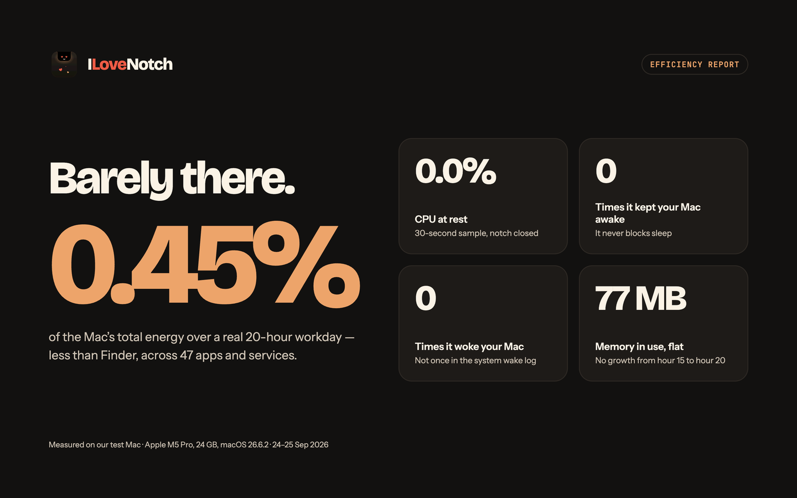
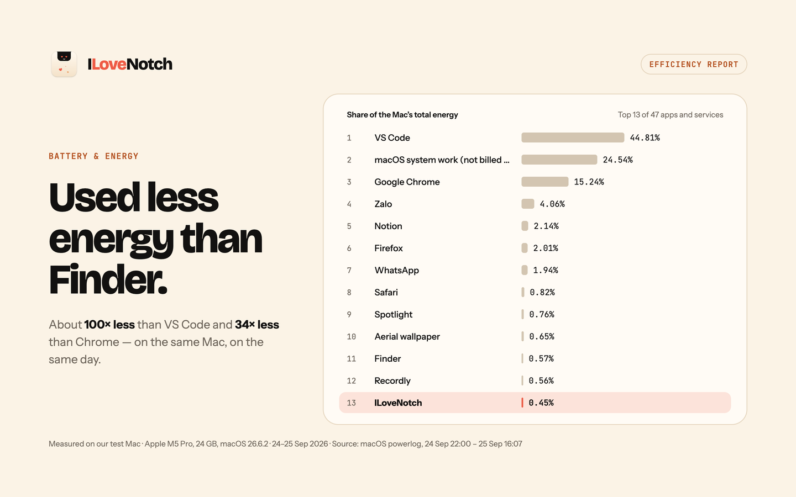
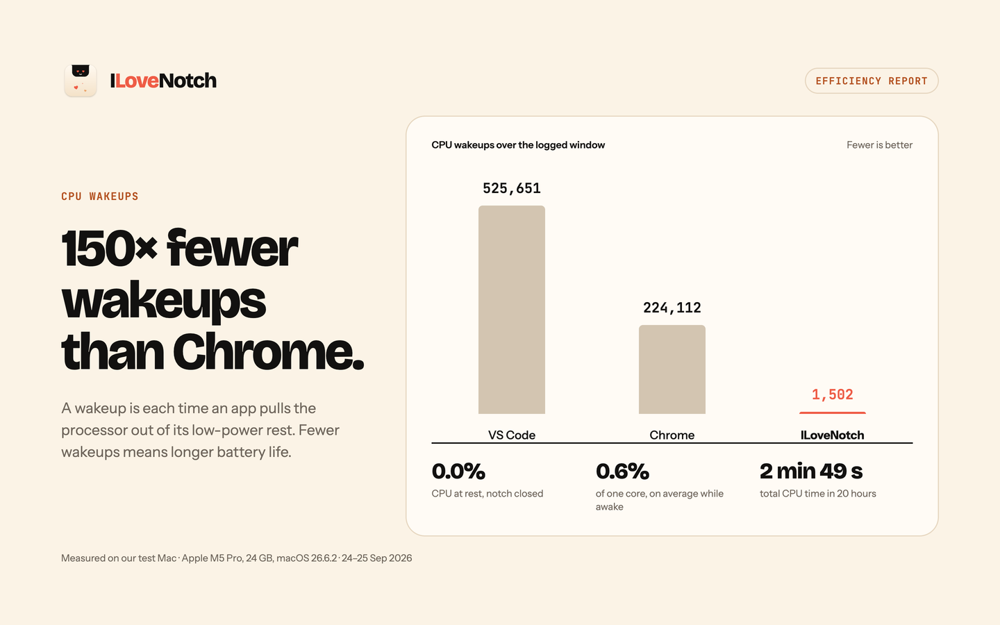
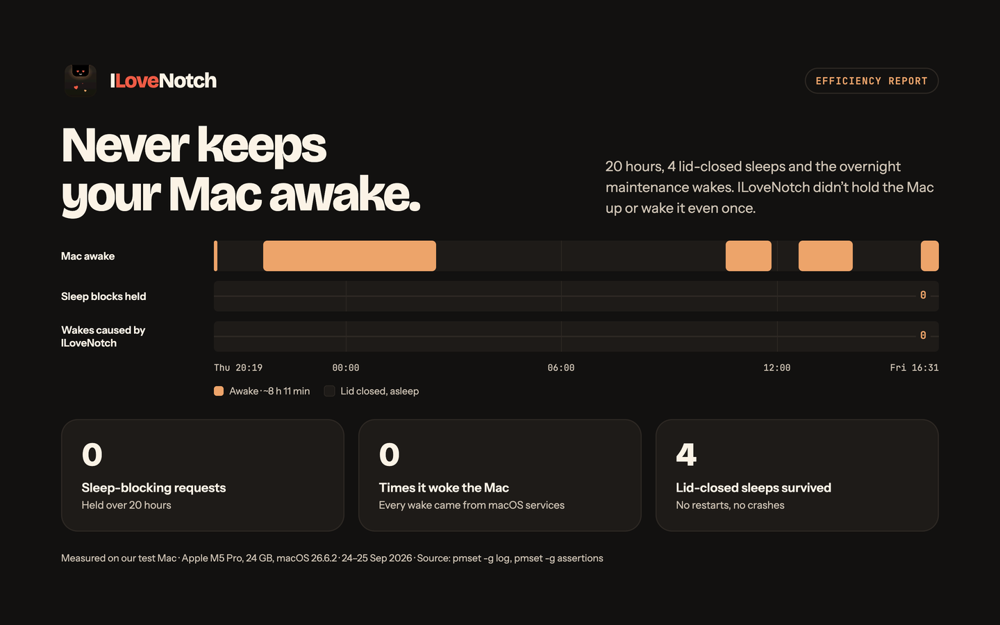
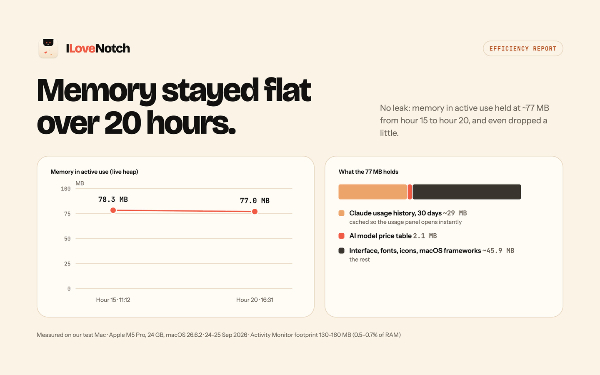
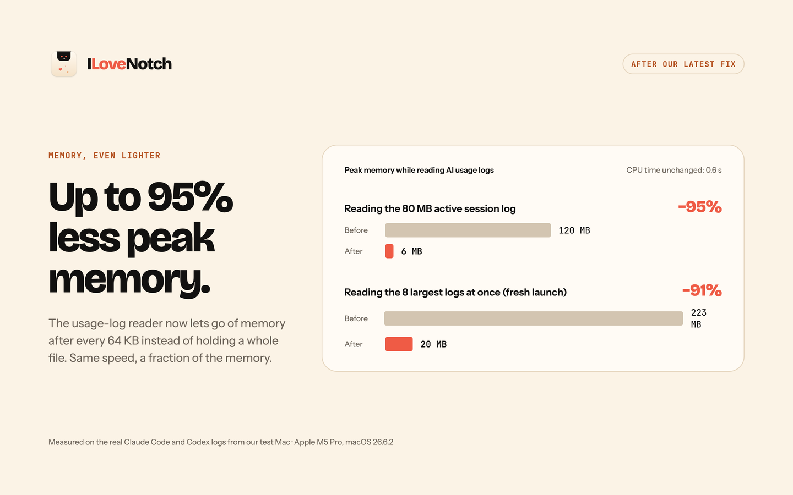

https://github.com/user-attachments/assets/9d0c486c-5169-4297-b8b9-8fedbb9eadda

<p align="center">
  
</p>

<h1 align="center">ILoveNotch</h1>

<p align="center"><b>Your MacBook's notch, finally useful.</b> Free and open source.</p>

<p align="center">
  <a href="https://github.com/niyamvora/ILoveNotch/releases/latest"></a>
  <a href="https://github.com/niyamvora/ILoveNotch/actions/workflows/ci.yml"></a>
  <a href="LICENSE"></a>
  <a href="#build--run"></a>
  <a href="https://github.com/sponsors/niyamvora"></a>
</p>

An **original, open-source** macOS menu-notch utility — turns the notch on Apple
Silicon MacBooks into an interactive tray for media, files, your calendar, tasks,
notes, shortcuts, timers, your camera, and how much of your AI plans you've
used. Built native (SwiftUI + AppKit) with a **hard focus on low RAM and
near-zero idle CPU** ([measured](#efficiency)).

<p align="center">
  
</p>

<p align="center">
  
  
  
  
  
  
</p>

> **Not affiliated with, endorsed by, or derived from any commercial notch app.**
> This is a clean-room implementation written from scratch. It contains no
> disassembled or decompiled code, and nothing from any commercial notch app.
> Features are common-idea reimplementations. Everything here is original or
> comes from permissively licensed open-source projects (MIT, BSD, CC0), listed
> in [THIRD_PARTY_NOTICES.md](THIRD_PARTY_NOTICES.md).

## Download

**[Download ILoveNotch](https://github.com/niyamvora/ILoveNotch/releases/latest)**
(free, macOS 14.6 or later): open the download, drag ILoveNotch into
Applications, and open it. It updates itself from then on.

- **Homebrew:** `brew install --cask niyamvora/tap/ilovenotch`
- **Mac App Store:** in review. The App Store edition has everything except AI
  Usage, which the App Sandbox rules out. Try it now through the
  [TestFlight beta](https://testflight.apple.com/join/6p3zqhCS).
- **From source:** see [Build & run](#build--run).

## Coming from NotchNook?

NotchNook's license server went offline in September 2026, so paid licenses
stopped activating, and lo.cafe
[told customers to use an alternative](https://x.com/locafe_24h/status/2095262917486665735).
ILoveNotch covers the everyday things: now playing, a file shelf, and your
calendar, plus Reminders, notes, Shortcuts, and timers. There's no license,
account, or server that can go away, and it's MIT licensed, so the code stays
public and buildable whatever happens to the project.

## What it does

- **The notch.** Opens when you hover it, click it, pull down with two fingers,
  or press ⌃⌥O in any app, and closes when you move away. Closed, it hides
  behind the camera housing until it has something to tell you, like a meeting
  about to start. Pick how it opens and closes (spring, jelly, pop, smooth,
  snappy, or instant), drag its bottom-right corner to resize it, and pin it
  open. On macOS 26, open it in Liquid Glass instead of black. Works on every
  display: where there's no notch, it draws one inside the menu bar, or a
  floating pill if you'd rather.
- **Media.** What's playing in any app, with artwork, controls, a seek bar, and
  a waveform that moves with the music.
- **Shelf.** Drop files on the notch to keep them at hand; drag them back out,
  preview them with Quick Look, or send them with AirDrop. Android phones
  share with it too, over Quick Share on your Wi-Fi: send shelf files to a
  phone, and accept files and links from one right in the notch.
  [More below](#android).
- **Clipboard.** Turn on a history of what you copy (text, links, images, and
  files), search it with ⌃⌥V from any app, and copy anything again, with
  favorites that stay. Passwords and anything marked private are skipped.
- **Calendar and Tasks.** Today's events with the tasks due today, an event
  field that understands "Lunch tomorrow 1pm", and your own events to edit or
  delete right in the notch. A Join button for Zoom,
  Google Meet, Teams, Webex, Whereby, Jitsi, and FaceTime calls, and a
  countdown in the closed notch for the five minutes before one starts. Your
  Apple Reminders, grouped by date or list, synced to your iPhone through
  iCloud: add them in plain words ("Pay rent fri 9am !! #Home"), set dates,
  priorities, lists, and alerts, block time for one in Calendar, and see it on
  the notch when it's due.
- **Notes, Shortcuts, and Timer.** Markdown notes that save as you type, with
  colors, pins, search, checklists you can send to Tasks, and a
  Control-Option-N shortcut; your shortcuts one click away; a timer and a
  stopwatch with laps; and Keep Awake, which stops your Mac sleeping for a
  while or until you turn it off, with the time left in the closed notch.
- **Mirror.** Your camera, off until you turn it on, and on only while its tab
  is open.
- **AI Usage.** How much of each AI coding plan you've used, as a card per tool,
  across 11 providers. [More below](#ai-usage).
- **Agents.** When Claude Code or Codex needs your approval, the closed notch
  says so until you answer, and it tells you when one finishes while you're in
  another app; one click takes you back to its terminal.
  [More below](#agent-status).
- **System activities.** Volume, charging and battery, and Bluetooth accessory
  batteries show briefly in the notch, and it can stand in for the macOS volume
  display.
- **Show in Notch.** A Shortcuts action and an `ilovenotch://` link put your own
  message in the notch, from any shortcut, automation, script, or app.
  [More below](#show-in-notch).
- **Updates.** A build from this checkout updates itself from the menu bar;
  signed releases update through Sparkle. A sandboxed Mac App Store edition
  builds from the same code.

## Why

Notch utilities are genuinely useful, but the popular closed-source one drew
complaints about heavy RAM/CPU use, and in September 2026 its license server
went offline, so paid licenses stopped working. ILoveNotch is a free, efficient
alternative with nothing to switch off: no license, no account, no server, and
code anyone can inspect, build, and improve.

## Efficiency

Measured over a real 20-hour workday on an Apple M5 Pro MacBook (24 GB, macOS
26.6.2), 24–25 September 2026.

<p align="center">
  
  
  
  
  
  
</p>

## Design principles (the efficiency story)

1. **No polling timers.** State changes come from events (hover, clicks, system
   notifications). The only timers are one-shot deadlines, like the hover dwell,
   cancelled the moment they stop mattering. Idle app = idle CPU. The one
   exception is clipboard history, since macOS has no "clipboard changed"
   event: off until you turn it on, it then reads a counter twice a second.
2. **Accessory app.** No Dock icon (`LSUIElement`), one small menu bar item for
   Settings and Quit, and the notch never steals focus (`nonactivatingPanel`).
3. **Lazy features.** Each feature module is `stopped`, `background` (cheap
   event observers only), or `foreground` (on screen). Hidden tabs cost nothing.
4. **Native, no Electron/webview.** Pure SwiftUI/AppKit.
5. **Measured, not assumed.** Signposts on every event, performance tests in CI,
   and an Instruments pass per feature against the
   [performance budgets](docs/plan/implementation-plan.md#8-performance-gates).

## Architecture

```text
hover, clicks, drags, sleep/lock, display changes
  → NotchEvent
  → NotchState.handle(_:)   pure reducer: next state + effects
  → NotchEngine             one per display: runs deadline timers
  → FeatureHost             runs each feature at the highest phase any display asks for
  → NotchView               one animatable notch shape inside a fixed panel
```

| Module | Role |
|--------|------|
| `App/` | App target generated from `project.yml`: wires features in, menu bar item, Settings |
| `NotchCore` | State machine, `NotchEngine`, `FeatureHost` lifecycle, preferences, typed logging and signposts. No AppKit. |
| `NotchSurface` | Fixed click-through `NSPanel` per display, animatable `NotchShape`, `PanelCoordinator` (displays, sleep, lock), notch geometry from **public** APIs (`safeAreaInsets`, `auxiliaryTop*Area`) |
| `NotchFeatures` | Feature modules (Media, Shelf, Clipboard, Calendar, Tasks, Notes, Shortcuts, Timer, Mirror), each a `NotchFeature` with its views and settings, and the event-driven system monitors and hooks (volume, battery, accessories, volume keys, keyboard shortcuts, Show in Notch) |
| `NotchUsage` | The GitHub build's developer tabs: AI Usage (provider tiles, rings, pace, spend, and trends, over providers adapted from [OpenUsage](https://github.com/robinebers/openusage) (MIT) in `NotchUsage/OpenUsage`) and Agents (Claude Code and Codex hooks, in `NotchUsage/Agents`) |
| `NotchTransfer` | The GitHub build's Android sharing: Quick Share on Apple's own frameworks (Bonjour, CryptoKit, Network.framework) in `NotchTransfer/QuickShare`, with the shelf's request card, the send window, and settings |
| `ThirdParty/` | [mediaremote-adapter](https://github.com/ungive/mediaremote-adapter) (BSD-3-Clause) as a git submodule |
| `Tests/` | Unit tests (reducer transitions and fuzzing, engine, feature host, preferences, geometry, features), offscreen snapshot tests, XCTest performance tests, and OpenUsage's provider tests on its fixtures (`OpenUsageTests`) |

The full design is in the [implementation plan](docs/plan/implementation-plan.md)
and the [architecture diagram](docs/plan/architecture.html).

## Build & run

Requires macOS 14.6+, Xcode 16+, and [Homebrew](https://brew.sh).

```bash
git clone --recurse-submodules https://github.com/niyamvora/ILoveNotch.git
cd ILoveNotch
make setup                        # installs XcodeGen (Brewfile) and fetches submodules
make run                          # generate the Xcode project, build, and launch ILoveNotch.app
make install                      # build a Release app into /Applications and launch it
make update                       # pull main when it's clean, then reinstall and relaunch
make test                         # unit, snapshot, and performance tests (plain SwiftPM)
make check                        # everything CI runs: secrets, lint, tests, build, licenses
make build-app-store              # the sandboxed App Store edition
scripts/soak.sh                   # sample the running app's CPU and memory against the budgets
```

`make project` generates `OpenNotch.xcodeproj` (git-ignored) for working in Xcode. The project,
its targets, and the code keep the original name OpenNotch; the app is ILoveNotch everywhere
people see it.
Watch the state machine live with:

```bash
log stream --level debug --predicate 'subsystem == "cafe.opennotch.app"'
```

### Test it on your Mac

1. `make install` builds a Release app into `/Applications` and launches it.
   There's no Dock icon: look for the notch, and for the ILoveNotch item in the
   menu bar (version, Update ILoveNotch, Settings…, Sponsor, Quit).
2. Quit other notch apps first; two apps can't share the notch.
3. Hover the notch (or click it, or pull down with two fingers), then try each
   tab. Calendar and Tasks ask for access the first time you tap **Allow Access**.
   Resize the open notch by dragging its bottom-right corner, keep it open with
   the pin beside Settings, and pick how it opens and closes in
   **Settings › General**.
4. To get the latest, choose **Update ILoveNotch** from the menu bar item (or run
   `make update`). It pulls `main` when your checkout is clean, rebuilds, and
   relaunches; see [updates](docs/updates.md).
5. With an Apple Development certificate in your keychain (Xcode › Settings ›
   Accounts), builds are signed with it and keep Calendar and Reminders access
   across updates. Without one they're ad-hoc signed, and macOS asks again after
   each rebuild.
6. To start at login, turn on **Settings › General › Launch at login**.
7. To uninstall, choose **Quit** from the menu bar item and delete
   `/Applications/ILoveNotch.app`; data lives in
   `~/Library/Application Support/OpenNotch`.

## Now playing

Since macOS 15.4, only Apple's own processes may read system-wide now-playing
information. ILoveNotch uses [mediaremote-adapter](https://github.com/ungive/mediaremote-adapter),
which runs in the system `perl` (an Apple process) as a separate helper, so the
private framework never loads into ILoveNotch. If a future macOS breaks it, Media
falls back to Music and Spotify's public notifications and says so.

The waveform under the player moves with the music. It listens to your Mac's
audio output only while Media is open and playing, so macOS asks once for
permission to capture system audio. Nothing is recorded; see
[PRIVACY.md](PRIVACY.md). Turn it off in **Settings › Features › Media**.

## AI usage

The AI Usage tab shows how much of your AI coding plans you've used, as a small
dashboard card per tool:

- Claude, Codex, Cursor, Copilot, Antigravity, Devin, Grok, Ollama, OpenCode,
  OpenRouter, and Z.ai are supported.
- Each card shows its main limit as a ring, the others as bars, when they reset,
  and whether they'll last until then. Click a card for spend, the daily trend,
  and every limit.
- Alerts show in the notch when a limit passes 80% or 95%, or resets.

Each provider is off until you add it from the tray under the cards, where the
tools signed in on this Mac are in color, or in **Settings › AI Usage**.
OpenRouter and Z.ai have no sign-in to reuse, so they take an API key, pasted
in **Settings › AI Usage** and kept in your keychain.

Each provider reads the sign-in its own tool keeps on this Mac and sends it only
to its own service. What it reads and sends is in
[PRIVACY.md](PRIVACY.md#ai-usage). The provider code is adapted from
[OpenUsage](https://github.com/robinebers/openusage) (MIT), and ILoveNotch isn't
affiliated with it. The tab is in the GitHub build only: reading other tools'
sign-ins doesn't fit the App Store's sandbox.

## Agent status

The Agents tab shows what Claude Code and Codex are doing in your terminals:
working, finished, or waiting for you to approve something. While one waits,
the closed notch shows a raised hand and the project until you answer, and when
one finishes while its app is in the background, the notch says so. **Go**
brings its terminal forward.

Nothing is connected until you connect it, in the tab or in **Settings ›
Features › Agents**. Connecting adds hooks to the tool's own settings
(`~/.claude/settings.json`, or `~/.codex/hooks.json`, which Codex asks you to
trust the next time it starts), next to any hooks already there, and
disconnecting takes out exactly those. The hooks run in the background, so an
agent never waits on them, and they write one small file per session: its
state, project folder, terminal app, and what it's waiting for, never your
prompts or code. Nothing leaves your Mac; see [PRIVACY.md](PRIVACY.md#agent-status).
Like AI Usage, it's in the GitHub build only, since hooks don't fit the App
Store's sandbox.

## Show in Notch

Shortcuts has a **Show in Notch** action, with a message, an SF Symbol, and how
many seconds to show it, so any shortcut or automation can put a message in the
notch. Scripts and other apps can open a link instead:

```bash
open -g "ilovenotch://show?title=Build%20done&symbol=hammer.fill&seconds=5"
```

A message shows for 1 to 30 seconds (4 by default) and is never stored. It's
only ever displayed: links in it aren't opened, line breaks and control
characters are removed, and it's cut to 80 characters. Both editions have it,
the App Store one too.

## Android

The shelf shares with Android phones over Quick Share, Android's own AirDrop,
on your Wi-Fi. Nothing gets installed on the phone, and nothing goes through
the internet or a server.

- **From a phone.** On the phone, tap **Share › Quick Share** and pick your
  Mac. The notch opens on the shelf with the phone's name, what it's sending,
  and a 4-digit code that matches the phone's. Nothing is saved until you
  **Accept**. Files go to Downloads (or a folder you choose), each one only once
  it has arrived whole, and onto the shelf. A link or text goes to the
  clipboard, and a web link gets **Open**.
- **To a phone.** Right-click a shelf file and choose **Send to Android…**, or
  click **Send to Android** under the shelf. A window like AirDrop's lists the
  phones nearby; pick one and accept on the phone. If the phone isn't listed,
  scan the window's QR code with its camera: Quick Share opens and the files go
  straight to it.

Phones can't see your Mac until you say so. **Receive from Android** under the
shelf makes it visible for 10 minutes, and **Settings › Features › Shelf** has
**Off** (the default), **While the notch is open** (and for a minute after), or
**Always**, along with the name phones see and where files go. While the Mac is
asleep or locked, it's never visible. macOS asks once for Local Network access.

Good to know:

- **Same Wi-Fi only.** Guest, hotel, and office networks that keep devices
  apart block it, and the speed is your router's.
- **Phones that don't show up in the list.** Most phones announce themselves on
  Wi-Fi only after a Bluetooth signal a Mac can't send, and Samsung's never do
  without it. The QR code works for all of them. Other phones show up while
  Quick Share's receive screen is open and set to **Everyone**.
- **Everyone, not Contacts.** Contacts-only sharing needs a Google account, so
  your Mac appears to anyone nearby while it's visible, and asks you first
  every time.
- **Unofficial.** Quick Share isn't an API Google offers for the Mac, so an
  Android update could change it; the code lives in one module
  (`NotchTransfer/QuickShare`) to fix quickly. It's in the GitHub build for
  now.

If the phone doesn't see your Mac, check **Visible** shows under the shelf, that
both are on the same Wi-Fi, and that ILoveNotch is on in **System Settings ›
Privacy & Security › Local Network** (and allowed through the firewall, if it
asked). To see what happens during a transfer:

```bash
log stream --level debug --predicate 'subsystem == "cafe.opennotch.app" && category == "transfer"'
```

ILoveNotch's own implementation follows the message definitions in Google's
open-source Quick Share code ([google/nearby](https://github.com/google/nearby),
Apache-2.0) and the protocol notes of
[NearDrop](https://github.com/grishka/NearDrop).

## Tasks and notes

Tasks use Apple **Reminders** through EventKit, so they sync to your iPhone over
iCloud with no server to run, and alerts set in the notch ring on every device.
Notes are Markdown files named after their first line, in
`~/Library/Application Support/OpenNotch/Notes` by default. To read them on an
iPhone, pick a folder in iCloud Drive in Settings › Features › Notes: they show
up in the Files app and in Markdown apps such as Obsidian. A note's color and
pin are kept in a small front matter block those apps understand, and a file you
named yourself keeps its name when you edit it in the notch. The Share button
sends a copy to Apple Notes; driving Apple Notes directly through Apple Events
was dropped as brittle and permission-heavy. (Google **Keep** is intentionally
not used: it has no official API.) Calendar and Reminders access is requested
only when you tap **Allow Access** in their tab.

## Contributing

Questions and ideas go in [Discussions](https://github.com/niyamvora/ILoveNotch/discussions);
bugs and feature requests in [Issues](https://github.com/niyamvora/ILoveNotch/issues/new/choose).
See [CONTRIBUTING.md](CONTRIBUTING.md). Report vulnerabilities privately as
described in [SECURITY.md](SECURITY.md); privacy commitments are in
[PRIVACY.md](PRIVACY.md).

## Sponsors

ILoveNotch is free and open source. If it's useful to you,
[sponsor the project](https://github.com/sponsors/niyamvora) to help keep it
maintained, and star the repo so more people find it.

<!-- ponytail: add a tiered logo table here (like chanhdai.com's README) once there are sponsors -->

## License

MIT — see [LICENSE](LICENSE).
